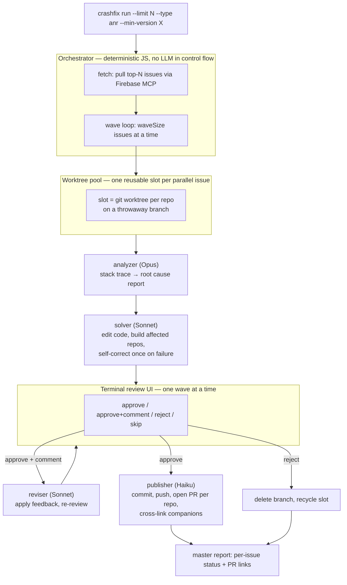

# CrashlyticsAgent

An automated pipeline that turns your top Firebase Crashlytics crashes and ANRs into
reviewed, PR-ready fixes.

Point it at an Android or Kotlin Multiplatform repo. It pulls the worst issues from
Crashlytics, has Claude analyse each one against your real source, generates a fix on a
dedicated branch, builds the affected modules to check it, and shows you every fix in a
terminal review UI. Approve, comment, or reject each one; approved fixes are pushed and
opened as pull/merge requests — cross-linked when a single crash spans the app repo and
shared modules.

The pipeline lives in [`crashfix/`](crashfix/) — a standalone Node/TypeScript CLI.

---

## Repository layout

| Path | What it is |
|---|---|
| [`crashfix/`](crashfix/) | The tool: CLI, orchestrator, workers, connectors, review TUI. [Full usage docs →](crashfix/README.md) |
| [`docs/superpowers/specs/`](docs/superpowers/specs/) | The design spec that was agreed before any code |
| [`docs/superpowers/plans/`](docs/superpowers/plans/) | The 22-task implementation plan that was executed against it |

---

## How it works



**Key design choices:**

- **The orchestrator is plain JavaScript.** A state machine sequences the phases, fans
  out work, and gates on your review. Claude is invoked only inside the workers — never
  to decide control flow.
- **A fixed pool of git worktrees**, reused across the whole run, keeps disk and build
  load bounded on a laptop. Issues are processed in waves so you review in digestible
  batches and can pause/resume (`crashfix resume`) at any point.
- **Model per job:** Opus for analysis, Sonnet for code, Haiku for text. Every worker's
  model is overridable in config.
- **Multi-repo aware.** For an independent-nested-repo layout (app repo + shared module
  repos checked out inside it), one fix can touch several repos; you review it as one
  unit and it produces one PR per affected repo, cross-linked.
- **Pluggable issue source.** Firebase Crashlytics via its MCP server is the default;
  any MCP server exposing list/get-issue tools can be added as another connector.

---

## Using it

See [`crashfix/README.md`](crashfix/README.md) for install, prerequisites (Firebase
login, git-host tokens, Claude auth), the full config reference, and the review-UI
keys. In short:

```bash
cd crashfix && npm install && npm run build
cd /path/to/your/android-or-kmp/repo
node /path/to/crashfix/dist/cli.js init
node /path/to/crashfix/dist/cli.js run --limit 10 --type anr
```

(or `npm i -g crashfix` once it is published, then just `crashfix …`)

---

## Development

```bash
cd crashfix
npm install
npm test          # vitest — 130 tests, all offline (no live SDK / Firebase / network)
npm run build     # tsc → dist/
npx tsc --noEmit  # type-check only
```

Tests never call the real Anthropic SDK, Firebase, gradle, or any git host — the SDK,
git layer, HTTP providers, and connectors are all interface-bound with fakes. Integration
and end-to-end tests run against real `git` in temp directories with local bare remotes.

### Structure

```
crashfix/src/
  cli.ts  cli/            command entry points (init, run, resume, status, clean)
  config.ts  types.ts     zod-validated config, shared domain types
  orchestrator/           run.ts (wave loop, resume), phases.ts, pool.ts, semaphore.ts, validate.ts
  workers/                spawn.ts (SDK wrapper), analyzer, solver, reviser, publisher, solve-core
  connectors/             contract + registry; firebase.ts (default), fake.ts (tests)
  publish/                github / bitbucket / gitlab PR APIs + cross-linking
  tui/                    Ink review UI (issue list, diff/summary panes, decision reducer)
  git.ts  state.ts  report.ts  reposcan.ts
```

---

## Project history

Built spec-first: a design was agreed
([`docs/superpowers/specs/`](docs/superpowers/specs/)), decomposed into a 22-task
plan ([`docs/superpowers/plans/`](docs/superpowers/plans/)), and each task implemented
test-first with an independent review and fix loop, followed by a whole-branch review
before merge. The commit history reflects that: one `feat` commit per task, each
followed by its review-round `fix` commits.
